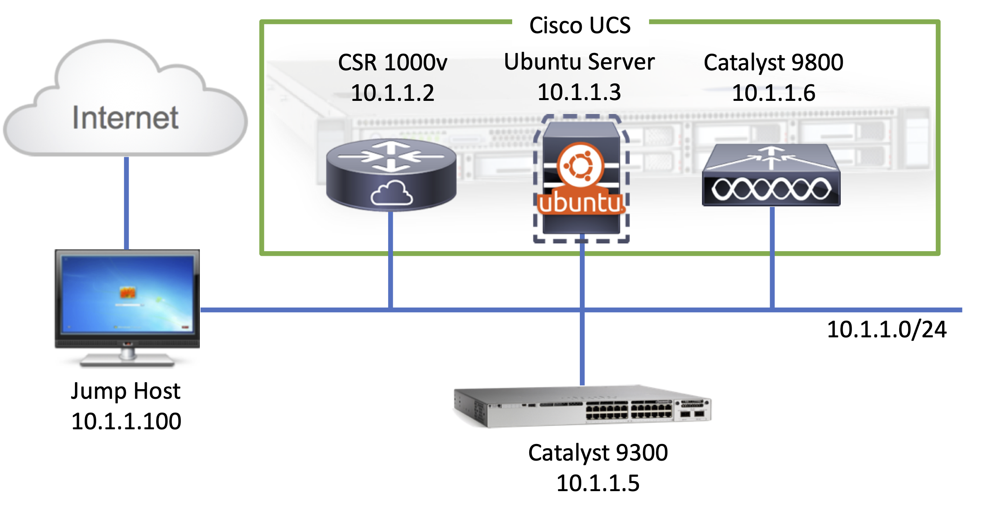
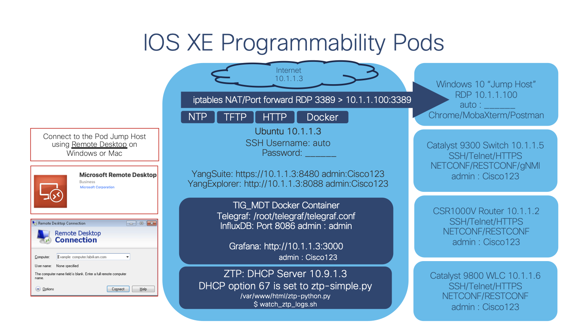
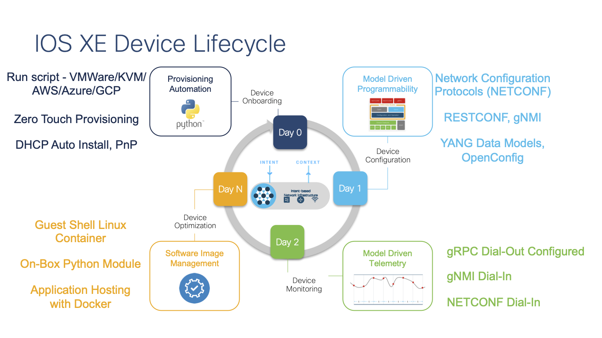

# Welcome to the Cisco IOS XE Programmablity Lab

### Lab Topology
To access the lab, you will need to use a Remote Desktop connection to the specific jump host.  The jump host is used to allow remotes access into all lab devices within the given pod envrionment.

Please refer to the IOS XE Programambility Lab Acess Sheet for specific pod access instructions and details

The services, features, and technologies that are enabled with the lab envrionment are shown below:

The modules below enable IOS XE Device Lifecycle Management:

## Modules

# Day 0 - Guest Shell, Guest Share
#### [https://github.com/jeremycohoe/cisco-ios-xe-programmability-lab-module-2-python](https://github.com/jeremycohoe/cisco-ios-xe-programmability-lab-module-2-python)

Details of Guest Shell, Guest Share.

# Day 1 - API Role Based Access Control
#### [https://github.com/jeremycohoe/cisco-ios-xe-programmability-lab-module-3-neconf-yang](https://github.com/jeremycohoe/cisco-ios-xe-programmability-lab-module-3-neconf-yang)

Details of API RBAC

# Day 2 - gRPC Model Driven Telemetry + TLS

Add details and link etc

# Day N - gNOI cert.proto Certificate Management API
#### [https://github.com/jeremycohoe/cisco-ios-xe-programmability-lab-module-5-gnmi](https://github.com/jeremycohoe/cisco-ios-xe-programmability-lab-module-5-gnmi)

Details

# Tooling - pyATS
#### [https://github.com/jeremycohoe/cisco-ios-xe-programmability-lab-module-6-mdt](https://github.com/jeremycohoe/cisco-ios-xe-programmability-lab-module-6-mdt)

pyATS

